# HRNet to Kneron (KL730) 模型轉換

本專案提供了一套流程，將 HRNet 姿態估計模型 從 PyTorch 權重 (.pth) 轉換為 Kneron 730 專用的硬體模型 (.nef)。用了點 AI 和 docker 的小魔法，簡化了過程中容易出錯的環境和檔案設定。

步驟概覽

```mermaid
flowchart LR
    %% 全域樣式設定
    %% {init: {'theme': 'dark', 'themeVariables': { 'lineColor': '#FFFFFF' }}} %%

    %% 資料輸入 (側邊補給)
    subgraph Inputs [ 📁 0_Input ]
        direction TB
        Calib[[calib_images]]
        PTH([.pth file])
        TestImg([test.jpg])
    end

    %% 主流程：HRNet 環境
    subgraph HRNet_Env [ 🐳 Container: HRNet ]
        direction LR
        S2[Step 2: 匯出 ONNX] --> S3[Step 3: 修復與驗證]
    end

    %% 中間產物
    ONNX[[pose_hrnet_fix.onnx]]

    %% 主流程：Kneron 環境
    subgraph Kneron_Env [ 🐳 Container: Kneron ]
        direction LR
        S4[Step 4: 編譯與量化] --> S5[Step 5: NEF 測試]
    end

    %% 最終輸出
    subgraph Outputs [ 📁 0_Output ]
        direction TB
        NEF[[models_730.nef]]
        IMG([final_pose_result.jpg])
    end

    %% 關鍵連線：建立順序感
    PTH -.-> S2
    S2 --> S3
    TestImg -.-> S3
    
    S3 ==> ONNX
    
    ONNX ==> S4
    Calib -.-> S4
    S4 --> S5
    TestImg -.-> S5
    
    S5 ==> NEF
    S3 -.-> IMG
    S5 -.-> IMG

    %% 樣式美化
    classDef mainProcess fill:#3d3d3d,stroke:#fff,stroke-width:2px;
    classDef container fill:transparent,stroke-dasharray: 5 5,stroke-width:2px;
    classDef artifact fill:#44475a,stroke:#bd93f9,stroke-width:2px,color:#bd93f9;
    classDef inputNode fill:#282a36,stroke:#6272a4,color:#8be9fd;

    class S2,S3,S4,S5 mainProcess;
    class HRNet_Env,Kneron_Env container;
    class ONNX,NEF,IMG artifact;
    class PTH,Calib,TestImg inputNode;
    
    %% 強調主線連線
    linkStyle 4,5,10 stroke:#bd93f9,stroke-width:4px;
```




## 專案結構

轉換前請確保目錄結構如下，這是 Docker 掛載路徑的基礎：

```Plaintext
.
├── 0_Input                 # 存放所有輸入資源
│   ├── calib_images/       # [必備] 存放約 20-50 張量化用的校準照片
│   ├── *.pth               # [必備] HRNet 原始權重檔
│   └── test.jpg            # [建議] 測試用照片，確認 ONNX 邏輯正確
├── 0_Output                # 存放產出的 .onnx 與 .nef 檔案
├── 1_Hrnet2Onnx            # HRNet 轉換與修復腳本
├── 2_Onnx2Nef              # Kneron 轉換工具與 Dockerfile
├── .gitignore
├── docker-compose.yml
└── README.md
```

## 準備步驟

1. 下載模型權重： 將 [pose_hrnet_w32_256x192.pth](https://huggingface.co/Prophetetc/cocopose/blob/main/pose_hrnet_w32_256x192.pth?utm_source=chatgpt.com) 放入 `0_Input`。

1. 準備校準資料集： 在 `0_Input/calib_images` 放進 20~50 張與任務相關的照片。

    **Note: 這些照片將決定模型量化後的精度，建議使用與實際應用場景相似的照片。**

1. 從資料集挑選任一一張照片作為測試照片放在 `0_Input`，並命名為 `test.jpg`

## 執行流程

### Step 1: 構建環境

```Bash
docker compose build
```

需要等待一段時間，請耐心等候

### Step 2: 匯出 ONNX

將 PyTorch 權重轉換為標準 ONNX 格式：

```Bash
docker compose run --rm hrnet python export_hrnet_onnx.py \
    --weights /input/pose_hrnet_w32_256x192.pth \
    --cfg experiments/coco/hrnet/w32_256x192_adam_lr1e-3.yaml \
    --input_h 256 --input_w 192 --opset 12 --simplify \
    --output /output/pose_hrnet_w32_256x192.onnx
```

可能會有一些錯誤，但如果你看到 *`[ok] ONNX simplified.`* 等內容，代表模型已經成功匯出且模型結構已初步優化。你將會在 `0_Output` 看到名為 `pose_hrnet_w32_256x192.onnx` 的檔案。

### Step 3: 修復與驗證 ONNX (關鍵步驟)

由於 Kneron 工具鏈對特定算子有相容性要求，需執行修復並測試結果：

```Bash
# 1. 執行修復 (Fix Onnx Nodes)
docker compose run --rm hrnet python fix_onnx.py

# 2. 測試 ONNX 輸出數值
docker compose run --rm hrnet python test_onnx.py

# 3. 視覺化驗證：畫出骨架圖確認模型沒壞掉
docker compose run --rm hrnet python draw_result.py
```

請檢查 `0_Output` 是否產出了正確的骨架圖片，確保模型轉換過程沒有遺失關鍵資訊。

\*註：理論上是不需要執行修復的，應該是一個 Bug，有待日後處理。

### Step 4: 編譯為 Kneron NEF 檔案

使用 Kneron Toolchain 進行量化與硬體編譯：

```Bash
docker compose run --rm kneron python onnx2nef730.py \
    --onnx /output/pose_hrnet_fix.onnx \
    --chip 730 \
    --images /input/calib_images \
    --out_dir /output
```

看到 `✅ Done.` 出現後，`0_Output/models_730.nef` 即可用於硬體部署。

### （可選）Nef 測試

運行以下兩行可以測試輸出的 Nef 是否正確，結果會變成圖片輸出在 `0_Output`。

```Bash
docker compose run --rm kneron python test_nef730.py
docker compose run --rm kneron python draw_result.py
```

## 技術細節與常見問題

1. Kneron Toolchain 的目錄覆蓋問題

    `kneron/toolchain` 映像檔預設的工作目錄在 `/workspace`。若將本地資料夾直接掛載至此，會覆蓋掉容器內建的 `miniconda` 與工具鏈，常見影響是找不到 ktc 工具箱等類似錯誤。

    - 解法：將程式掛載於 `/workspace/docker_mount` 或其他地址即可確保工具箱完整無損。

1. Python 指令找不到的 Bug

    容器內建的 `ktc` 工具在執行子程序時會固定尋找 `python` 指令，而非 `python3`。

    解法：我們在 `Dockerfile` 中加入了「強制開機」魔法：

    ```Bash
    # 建立軟連結確保指令相容
    RUN ln -sf /workspace/miniconda/envs/onnx1.13/bin/python /usr/bin/python
    # 強制將正確的環境加入系統路徑
    ENV PATH="/workspace/miniconda/envs/onnx1.13/bin:$PATH"
    ```

    \*註：理論上是不該這樣做的，應該也是一個 Bug，有待日後處理。

1. Apple Silicon (M1/M2/M3) 警告

    若你在 Mac 上執行，Docker 會提醒平台不匹配（AMD64 vs ARM64）。

    說明：這是正常的，我們透過 `platform: linux/amd64` 強制執行，雖然速度稍慢但不影響結果。

## 常用指令

|指令目的|指令範例|
|-|-|
|進入互動式終端機|`docker compose run --rm [服務名] bash`|
|快速 Debug|`docker compose run --rm [服務名] ls -R /workspace`|
|清理容器殘留|`docker compose down`|
